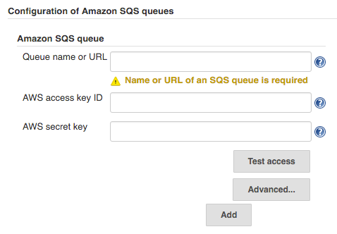
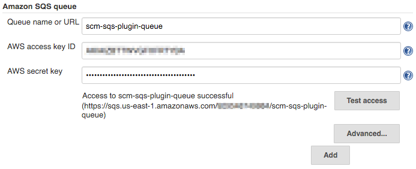
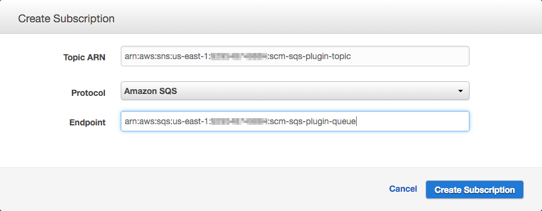

[](https://travis-ci.org/jenkinsci/scm-sqs-plugin)

#SCM SQS Plugin for Jenkins
A Jenkins plugin that allows to use the Amazon Simple Queue Service (SQS) as a build trigger. Currently supports messages sent by Git repositories hosted on Amazon's CodeCommit. In the future additional services may be supported.

To use this plugin you will need to have the following:

1. An Amazon Web Services (AWS) account
2. A Git repository that is hosted on CodeCommit
3. A Simple Notification Service (SNS) topic
4. A Simple Queue Service (SQS) queue
5. A user that is allowed to access the queue

#Table of contents
1. [Using the plugin](#using-the-plugin)
    1. [Install the plugin](#install-the-plugin-on-jenkins)
    2. [Set up AWS users](#create-a-jenkins-user-on-aws)
    3. [Create a repository](#create-a-codecommit-repository)
    4. [Create an SQS queue](#create-an-sqs-queue-on-aws)
    5. [Test access to the queue](#test-whether-jenkins-can-access-the-queue)
    6. [Create an SNS topic](#create-an-sns-topic-on-aws)
    7. [Link SNS topic and SQS queue](#link-sns-topic-and-sqs-queue)
    8. [Link AWS CodeCommit and SNS topic](#link-aws-codecommit-and-sns-topic)
    9. [Configure Jenkins jobs](#configure-jobs-to-use-the-queue-on-jenkins)
    10. [Test your setup](#test-your-setup)
2. [Development](#development)
3. [License](#license)
4. [Maintainer](#maintainers)

##Using the plugin

This setup assumes that you already have an AWS account and that you're able to log in to your AWS account. You must also be able to manage users and groups and you must be able to create a CodeCommit repository, an SNS topic and an SQS queue. If you don't have the necessary permissions find someone who does.

###Install the plugin on Jenkins

1. Go to `Jenkins > Manage Jenkins > Manage Plugins`.
2. Go to `Available` and search for `scm-sqs` or `aws sqs`.
3. Install the plugin and restart your Jenkins.

If you've built the plugin from source go to `Advanced` and upload the plugin manually. Don't forget to check the plugin's Wiki page on Jenkins-CI.org: https://wiki.jenkins-ci.org/display/JENKINS/SCM+SQS+Plugin.

After you've successfully installed the plugin you should see a new entry in your global Jenkins configuration. Go to `Jenkins > Manage Jenkins > Configure System` to verify. You should be able to find an entry similar to the one below.



###Create a Jenkins user on AWS

1. Log in to your [Amazon Web Services](https://aws.amazon.com/) account.
2. Go to `Services > Security & Identity > IAM`
3. **Create** a **new group** called *Jenkins*
4. Assign the following managed policies to the user:

    * AmazonSQSFullAccess
    * AWSCodeCommitReadOnly

    The `AmazonSQSFullAccess` policy is required for Jenkins to be able to read messages from queues and to delete messages from queues once they've been processed.

    The `AWSCodeCommitReadOnly` permission is required for Jenkins to be able to check out code to build.

5. **Create** a **new user** called *Jenkins*
6. Assign the *Jenkins* user to the *Jenkins* group
7. Go to `IAM > Users > Jenkins > Security Credentials`
8. **Create** a new **Access Key** for the Jenins user

    **Important:** You will need the `Access Key ID` and `Secret Key` for Jenkins to be able to access the SQS queue. Make sure to save both values in a secure place.

###Create a CodeCommit repository

Before you start to configure the plugin you should have at least one Git repository on CodeCommit. If you do not already have a repository follow the steps below to create one.

**Note:** At the time of writing CodeCommit is only available in the [**US East (N. Virginia)** region](https://aws.amazon.com/about-aws/global-infrastructure/regional-product-services/). AWS will automatically switch to that region when you access CodeCommit. All services (CodeCommit, SNS, SQS) must be created in the same region, so do not switch regions after you've created the repository.

1. Go to `Services > Developer Tools > CodeCommit`

2. **Create** a **new repository**

3. Enter a name and description for the repository

At the very least you'll need to enter a new name for the repository. For this plugin we would use something like *scm-sqs-plugin*. To be able to work with repositories your user account also needs permission to access CodeCommit:

1. Go to `Services > Security & Identity > IAM`

2. Find and open your user account

3. Go to `Permissions`

4. Click on `Attach Policy`

5. Find the developer policy for your Git repository

When you create a repository AWS will automatically create a policy for it. In the example above the policy would be named *scm-sqs-plugin-developer*. Alternatively you could assign the policy *AmazonSQSFullAccess* which will automatically give your user access to all repositories on CodeCommit.

In addition to the policy your account also needs a public SSH key assigned. Access to repositories on CodeCommit is only possible via SSH.

1. Switch to the tab `Security Credentials`

2. `Upload` an `SSH public key`

3. You will need the `SSH Key ID` to access the repository

You should now be able to clone the repository and start working with it. The repository URL for our example would be *ssh://`ssh-key-id`@git-codecommit.us-east-1.amazonaws.com/v1/repos/scm_sqs_plugin*

###Create an SQS queue on AWS

**Note:** The SQS queue must be created in the same region as your CodeCommit repository. At the time of writing CodeCommit is only available in the **US East (N. Virginia)** region. This means the SQS queue must also be created in the US East region.

1. Go to `Services > Application Services > SQS`

2. **Create** a **new queue**

    At the very least you'll need to enter a new name for the queue. If you already have a repository something like **_repository-name_-queue** is a good idea. So for the *scm-sqs-plugin* repository we would use *scm-sqs-plugin-queue*.

    Review the remaining options and adjust them to your needs. If you do not know what these options do just leave them at their defaults.

3. Copy the *ARN* of the queue for later

###Test whether Jenkins can access the queue

1. Go to `Jenkins > Manage Jenkins > Configure System` on your Jenkins

2. Go to `Configuration of Amazon SQS queues`

3. Configure a queue

    * Enter the name of the queue you just created
    * Enter the *Access key ID* of the Jenkins user on AWS
    * Enter the *Secret key* of the Jenkins user on AWS

4. Click on **Test access**

You should see a success message as in the screenshot below. If you get an error message make sure you entered the credentials correctly. If you still see errors double check the user, group and permissions you set up on Amazon Web Services.



###Create an SNS topic on AWS

**Note:** The SNS topic must be created in the same region as your CodeCommit repository. At the time of writing CodeCommit is only available in the **US East (N. Virginia)** region. This means the SNS topic must also be created in the US East region.

1. Go to `Services > Mobile Services > SNS`
2. Go to `Topics`
3. **Create** a **new topic**

    Enter a new *topic name* (the display name is optional in our case). If you already have a repository something like **_repository-name_-topic** is a good idea. So for the *scm-sqs-plugin* repository we would use the *scm-sqs-plugin-topic*.

    The new topic should have an *ARN* similar to `arn:aws:sns:us-east-1:{id}:{topic-name}`.

###Link SNS topic and SQS queue

1. Click on the new topic you just created
2. **Create** a new **subcription**
    * The *Topic ARN* should be the ARN of the topic you just created.
    * Select **Amazon SQS** as the *protocol*
    * Use the *ARN* of the queue you created above as the endpoint

These steps make sure that all notifications that are posted to this topic are placed in our SQS queue we created above. For testing purposes you could create an additional subscription that delivers all messages also to your inbox.



###Link AWS CodeCommit and SNS topic

1. Go to `Services > Developer Tools > CodeCommit`
2. Select a repository (or create a new one)
3. Click on the repositry
4. Go to `Triggers`
5. **Create** a new **trigger**
    * Enter a new for your trigger (e.g. "send-to-sns-on-push")
    * Select **Push to existing branch** as *Events*
    * Select the branch(es) you want to monitor
    * Select *Send to Amazon SNS*
    * Select your SNS topic you created above
6. Click on **Create**

These steps make sure that whenever someone pushes changes to this repository a message is sent to SNS. The subscription we created on the notification service makes sure the message is fordwared to the SQS queue. The Jenkins plugin uses the Amazon API to monitor this queue for new messages.

###Configure jobs to use the queue on Jenkins

1. Go to `Jenkins > $job`
2. Click on `Configure`
3. Scroll down to `Build Triggers`
4. Check `Trigger build when a message is published to an Amazon SQS queue`
5. Select the queue you created previously

To reduce cost the Jenkins plugin does not start monitoring a queue until at least one job has been configured to listen to messages from a queue.

You can use the same queue for multiple jobs or you can create a new queue for each job. Keep in mind that monitoring multiple queues will increase the amount of requests your Jenkins will have to send to AWS. Unless you have specific needs reusing the same queue and topic for multiple jobs is completely acceptable. For billing purposes it may be easier to use multiple queues, especially if you're running builds on behalf of a customer.

###Test your setup

If you've set up everything correctly pushing a change to the Git repository on CodeCommit should now trigger a build on Jenkins. If nothing happens, make sure the job has been set to use messages posted to SQS as a build trigger.


#Development
1. Start the local Jenkins instance:

    mvn clean compile hpi:run

2. Wait until "Jenkins is fully up and running" is shown in the terminal
   (there may be more messages after that)
   
3. Open http://localhost:8080/jenkins/ in the browser


#License
Apache License, Version 2.0
```
Copyright 2016 M-Way Solutions GmbH

Licensed under the Apache License, Version 2.0 (the "License");
you may not use this file except in compliance with the License.
You may obtain a copy of the License at

     http://www.apache.org/licenses/LICENSE-2.0

Unless required by applicable law or agreed to in writing, software
distributed under the License is distributed on an "AS IS" BASIS,
WITHOUT WARRANTIES OR CONDITIONS OF ANY KIND, either express or implied.
See the License for the specific language governing permissions and
limitations under the License.
```

#Maintainers
- [Markus Pfeiffer](https://github.com/mpfeiffermway) (M-Way Solutions GmbH) – 2016
